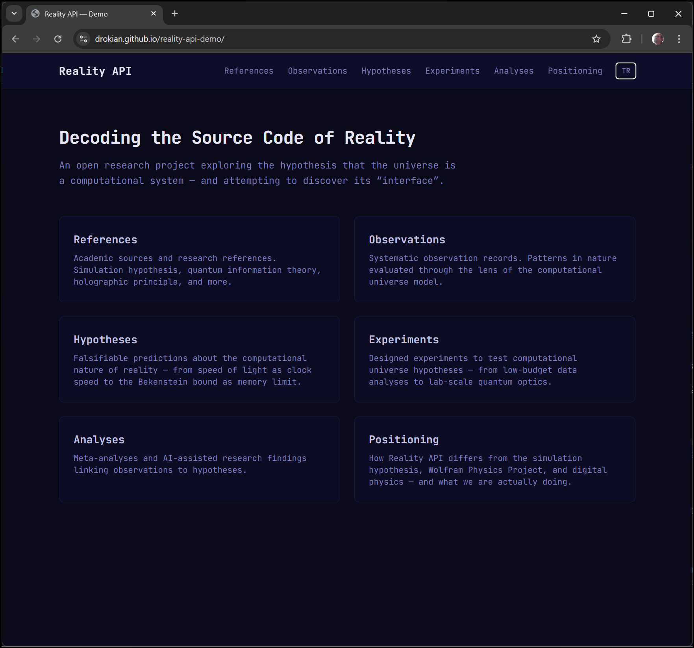

# Reality API Demo

> Turkish version: [README.tr.md](README.tr.md)

**Decoding the Source Code of Reality - Public Demo**



Live site: https://drokian.github.io/reality-api-demo

---

Reality API Demo is the public, read-only showcase of the Reality API research project.
It presents the computational reality hypothesis through structured observations, hypotheses, analyses, experiments, and academic references.

## Why Now

Scientific progress around information theory, quantum foundations, and computational modeling has made this line of inquiry more concrete and testable than before.
At the same time, public access to structured, bilingual research communication is still rare.
This demo exists to close that gap with a transparent, inspectable, and continuously updated public layer.

## Press Blurb

Reality API Demo is a public, bilingual showcase of an open research project investigating whether physical reality behaves like a computational system. It presents observations, hypotheses, analyses, experiments, and references in a read-only static format designed for clarity, auditability, and scientific dialogue.

## Core Hypothesis

Physical reality may operate as a computational system.
The demo communicates this as an active research program, not as a finalized scientific conclusion.

## Why This Demo Exists

- Public transparency without private-repo access
- Clear first contact for collaborators and reviewers
- Reliable static snapshot of current research state
- Bilingual communication for wider reach

## Feature Set

- Read-only pages for observations, hypotheses, experiments, analyses, references, and positioning
- English and Turkish language toggle
- Fully static architecture (no runtime DB, no runtime API)
- Snapshot-based data model from `src/data/snapshot.json`

## Quickstart

```bash
git clone https://github.com/drokian/reality-api-demo.git
cd reality-api-demo
npm install
npm run dev
```

Open: http://localhost:3000

## Build and Preview

```bash
npm run build
npm run start
```

`npm run start` serves the static `out/` directory.

## Status

Active public showcase for the Reality API project.

| Area | Status | Description |
|------|--------|-------------|
| Public demo UI | Active | Static read-only pages |
| Data snapshots | Active | `src/data/snapshot.json` updated from main workflow |
| Bilingual docs | Active | EN/TR documentation under `docs/` |
| Runtime backend | Not in demo scope | Available only in private full platform |

## Project Structure

```text
reality-api-demo/
├── README.md
├── README.tr.md
├── docs/
│   ├── en/
│   │   ├── MANIFESTO.md
│   │   ├── CONTRIBUTING.md
│   │   ├── ETHICS.md
│   │   ├── api.md
│   │   ├── database.md
│   │   ├── installation.md
│   │   ├── configuration.md
│   │   ├── troubleshooting.md
│   │   ├── glossary.md
│   │   ├── positioning.md
│   │   ├── 01-hypothesis.md
│   │   └── 02-roadmap.md
│   └── tr/ (mirrors en/)
├── src/
│   ├── app/
│   ├── components/
│   ├── data/
│   │   └── snapshot.json
│   └── lib/
│       └── data.ts
└── .github/workflows/deploy.yml
```

## Documentation

English docs:

- [docs/en/MANIFESTO.md](docs/en/MANIFESTO.md)
- [docs/en/CONTRIBUTING.md](docs/en/CONTRIBUTING.md)
- [docs/en/ETHICS.md](docs/en/ETHICS.md)
- [docs/en/positioning.md](docs/en/positioning.md)
- [docs/en/installation.md](docs/en/installation.md)
- [docs/en/configuration.md](docs/en/configuration.md)
- [docs/en/troubleshooting.md](docs/en/troubleshooting.md)

Turkish docs:

- [docs/tr/MANIFESTO.md](docs/tr/MANIFESTO.md)
- [docs/tr/CONTRIBUTING.md](docs/tr/CONTRIBUTING.md)
- [docs/tr/ETHICS.md](docs/tr/ETHICS.md)
- [docs/tr/positioning.md](docs/tr/positioning.md)
- [docs/tr/installation.md](docs/tr/installation.md)
- [docs/tr/configuration.md](docs/tr/configuration.md)
- [docs/tr/troubleshooting.md](docs/tr/troubleshooting.md)

## Data Update Flow

- Source of truth lives in the private full platform.
- Demo consumes exported snapshot data in `src/data/snapshot.json`.
- On `main` updates (`src/data/snapshot.json`, `src/**`, `public/**`), GitHub Actions builds and deploys to GitHub Pages.

## Full Platform

The full operational platform (database, admin, forms, translation workflows) is maintained privately at:
https://github.com/docyazilim/reality-api

## License

MIT
