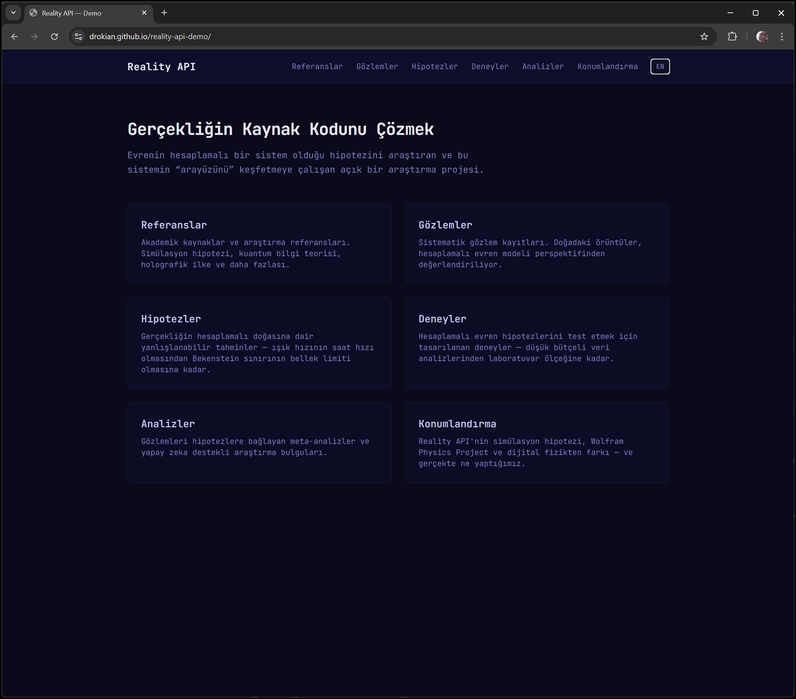

# Reality API Demo

> English version: [README.md](README.md)

**Gercekligin Kaynak Kodunu Cozmek - Public Demo**



Canli site: https://drokian.github.io/reality-api-demo

---

Reality API Demo, Reality API arastirma projesinin public ve read-only vitrini olarak tasarlanmistir.
Hesaplamali gerceklik hipotezini; yapisal gozlemler, hipotezler, analizler, deneyler ve akademik referanslar uzerinden sunar.

## Neden Simdi

Bilgi teorisi, kuantum temelleri ve hesaplamali modelleme alanlarindaki ilerleme, bu arastirma hattini gecmise gore daha somut ve test edilebilir hale getirdi.
Ayni zamanda, yapisal ve cift dilli bilimsel iletisim sunan public kaynaklar hala sinirli.
Bu demo, seffaf, denetlenebilir ve surekli guncellenen bir public katman olusturarak bu boslugu kapatmayi hedefler.

## Basin Metni

Reality API Demo, fiziksel gercekligin hesaplamali bir sistem gibi davranip davranmadigini arastiran acik bir projenin public ve cift dilli vitrini olarak tasarlanmistir. Gozlemler, hipotezler, analizler, deneyler ve referanslar; anlasilirlik, denetlenebilirlik ve bilimsel diyalog odagiyla read-only statik formatta sunulur.

## Temel Hipotez

Fiziksel gerceklik hesaplamali bir sistem gibi calisiyor olabilir.
Demo bu fikri nihai sonuc olarak degil, aktif bir arastirma programi olarak sunar.

## Demo Neden Var

- Private repo erisimi olmadan seffaflik saglamak
- Isbirlikciler ve degerlendiriciler icin net ilk temas noktasi sunmak
- Arastirma durumunu guvenilir statik snapshot ile yayinlamak
- Cift dilli iletisim ile daha genis kitleye ulasmak

## Ozellik Seti

- Gozlemler, hipotezler, deneyler, analizler, referanslar ve konumlandirma sayfalari
- English ve Turkce dil secimi
- Tamamen statik mimari (runtime DB yok, runtime API yok)
- `src/data/snapshot.json` tabanli veri modeli

## Hizli Baslangic

```bash
git clone https://github.com/drokian/reality-api-demo.git
cd reality-api-demo
npm install
npm run dev
```

Ac: http://localhost:3000

## Build ve Onizleme

```bash
npm run build
npm run start
```

`npm run start`, statik `out/` klasorunu servis eder.

## Durum

Reality API projesi icin aktif public vitrin.

| Alan | Durum | Aciklama |
|------|-------|----------|
| Public demo UI | Aktif | Statik read-only sayfalar |
| Veri snapshotlari | Aktif | `src/data/snapshot.json` ana akistan guncellenir |
| Cift dilli dokuman | Aktif | `docs/` altinda EN/TR dokuman seti |
| Runtime backend | Demo kapsami disi | Sadece private tam platformda |

## Proje Yapisi

```text
reality-api-demo/
├── README.md
├── README.tr.md
├── docs/
│   ├── en/
│   │   ├── MANIFESTO.md
│   │   ├── CONTRIBUTING.md
│   │   ├── ETHICS.md
│   │   ├── api.md
│   │   ├── database.md
│   │   ├── installation.md
│   │   ├── configuration.md
│   │   ├── troubleshooting.md
│   │   ├── glossary.md
│   │   ├── positioning.md
│   │   ├── 01-hypothesis.md
│   │   └── 02-roadmap.md
│   └── tr/ (en ile paralel)
├── src/
│   ├── app/
│   ├── components/
│   ├── data/
│   │   └── snapshot.json
│   └── lib/
│       └── data.ts
└── .github/workflows/deploy.yml
```

## Dokumantasyon

English dokumanlar:

- [docs/en/MANIFESTO.md](docs/en/MANIFESTO.md)
- [docs/en/CONTRIBUTING.md](docs/en/CONTRIBUTING.md)
- [docs/en/ETHICS.md](docs/en/ETHICS.md)
- [docs/en/positioning.md](docs/en/positioning.md)
- [docs/en/installation.md](docs/en/installation.md)
- [docs/en/configuration.md](docs/en/configuration.md)
- [docs/en/troubleshooting.md](docs/en/troubleshooting.md)

Turkce dokumanlar:

- [docs/tr/MANIFESTO.md](docs/tr/MANIFESTO.md)
- [docs/tr/CONTRIBUTING.md](docs/tr/CONTRIBUTING.md)
- [docs/tr/ETHICS.md](docs/tr/ETHICS.md)
- [docs/tr/positioning.md](docs/tr/positioning.md)
- [docs/tr/installation.md](docs/tr/installation.md)
- [docs/tr/configuration.md](docs/tr/configuration.md)
- [docs/tr/troubleshooting.md](docs/tr/troubleshooting.md)

## Veri Guncelleme Akisi

- Kaynak dogru private tam platformdadir.
- Demo, `src/data/snapshot.json` icindeki export verisini tuketir.
- `main` branch'te (`src/data/snapshot.json`, `src/**`, `public/**`) degisiklik oldugunda GitHub Actions build alip GitHub Pages'e deploy eder.

## Tam Platform

Veritabani, admin, form ve ceviri akislarini iceren tam operasyonel platform private repoda yer alir:
https://github.com/docyazilim/reality-api

## Lisans

MIT
